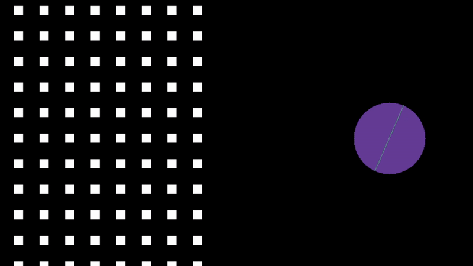

# PlayFizziks
Demo of the [Fizziks](https://github.com/Vessalia/Fizziks) physics engine.

## Building
- C++17 compatible compiler
- CMake 3.28 - 4.2
- Only tested on Windows
  
### Build Steps
PlayFizziks is built using CMake
```bash
git clone https://github.com/Vessalia/PlayFizziks.git
cd PlayFizziks
mkdir build
cmake -S . -B build
cmake --build build
```

## Demo

